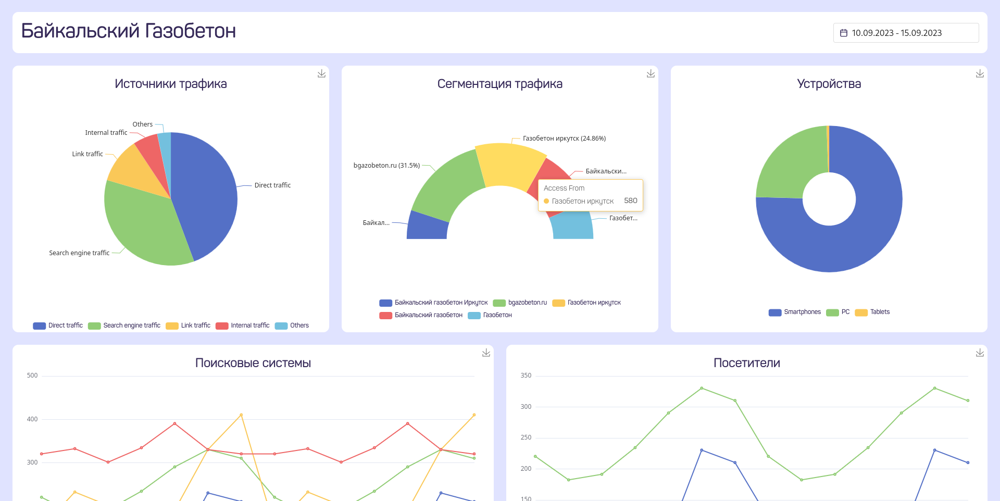

# SEO Dashboard

## О проекте

Проект представляет аггрегатор данных статистики из Яндекс.Метрики и Topvisor.



## Установка

Для запуска потребуется [Docker Compose](https://docs.docker.com/compose/install/).

### Настройка переменных среды

Конфигурационные переменные проекта необходимо указать в файле `.env`.
Все необходимые переменные прописаны в файле-шаблоне `.env.template`:

```sh
cp .env.template .env
```

В том числе, для корректной загрузки данных, необходимы токен Яндекс.Метрики и API-ключ Topvisor'а:

- [Получение токена Яндекс.Метрики](https://yandex.ru/dev/metrika/doc/api2/intro/authorization.html)
- [Получение API-ключа Topvisor'а](https://topvisor.com/ru/api/v2/#)

### Запуск контейнеров

```sh
docker compose up -d
```

## Использование API сервера

Адреса сервера и клиента (при запуске на локальном сервере):

- [Сервер](http://localhost:8000)
- [Клиент](http://localhost:8080)

Сервер не имеет корня страницы, так как предназначен только для получения данных от него.

### Получение данных

По адресу `/api/get/<категория данных>` можно получить загруженные в БД данные, дополнительно указав в параметрах запроса `date1` и `date2` - начало и конец периода, за который необходимо получить данные.

Категории данных:

- `new_users` - посещения и новые пользователи по датам;
- `traffic_sources` - источники траффика;
- `device_categories` - типы устройств пользователей;
- `search_engines` - поисковые системы;
- `search_phrases` - поисковые фразы (сегментация траффика);
- `goals` - статистика по выполнению настроенных целей;
- `positions` - позиции сайта;
- `tops` - процент выдачи в топ-10.

К каждому запросу можно добавлять параметры `date1` и `date2` для выбора периода, за который необходимо получить статистику.

### Загрузка данных

По адресу `/api/load/<категория данных>` можно загрузить данные в БД, которые будут автоматически загружены с соответствующего сервиса.

Категории данных:

- `visits` - загрузка всех необходимых данных из Яндекс.Метрики. Начало и окончание периода, за который необходимо выгрузить данные - `date1` и `date2` соответственно.
- `positions` - загрузка данных по позициям из Topvisor'а. Данные загружаются за период с 1-го числа предыдущего месяца и по текущую дату. Однако период можно сдвигать заменой текущей даты на какую-либо еще, передав ее в параметре `ref_date`
- `tops` - загрузка данных по выдаче в топ-10 из Topvisor'а. Работа с датами происходит аналогичным образом, как с позициями.

## Благодарность

Проекта бы не существовало без [Алдара](https://github.com/Aldarpower) и [Дмитрия](https://github.com/dogee4803),
которые написали весь Front, а также участвовали в разработке скриптов для получения данных, что, по сути, вся
логика Backend'а :)

Спасибо вам, Товарищи!
